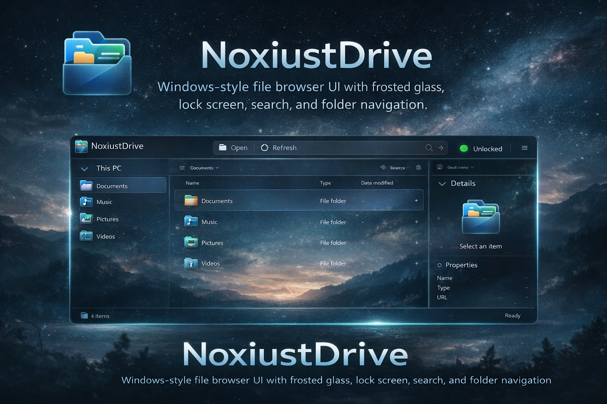

# NoxiustDrive



NoxiustDrive is a **fullscreen, Windows File Explorer–style web UI** for navigating server folders.  
It features a modern frosted-glass (“mica”) design, a Windows-like lock screen, and familiar Explorer interactions such as double-click to open, right-click context menus, search, and a details pane.

> ⚠️ This is a **frontend UI**. It relies on your web server to expose real directories.

---

## ✨ Features

- 🪟 **Windows Explorer–inspired UI**
- 🧊 **Frosted glass / mica effect** optimized for dark wallpapers
- 🔒 **Fullscreen lock screen** with background wallpaper
- 🔑 **Username + password login** (salted SHA-256 hash, no plaintext)
- 📂 **Real folder navigation** (no fake files)
- 🖱️ **Double-click to open folders**
- 🖱️ **Right-click context menu** (Open only, Explorer-style)
- 🔍 **Search box** (filters visible folders)
- 🧭 **“This PC” navigation tree**
- 🧾 **Details pane** (preview + properties)
- ⌨️ **Keyboard support** (arrow keys + Enter)
- 🖥️ **Fullscreen layout** (uses entire browser window)

---

## 📁 Folder Structure

Your server must expose real directories like:

```

/
├── index.html
├── documents/
├── music/
├── pictures/
│   └── wallpapers/
│       ├── wallpaper.jpeg      # lock screen
│       ├── wallpaper2.jpeg     # file browser background
│       └── banner.png          # README banner
└── videos/

```

> NoxiustDrive does **not** generate or fake file listings.

---

## 🚀 How It Works

- The UI lists **real folder URLs**
- Opening a folder navigates directly to that directory
- Your web server handles the actual file listing
- Login state is stored in `sessionStorage`
- Passwords are **never stored in plaintext**

---

## 🔐 Authentication Notes

- Uses **salted SHA-256 hashing** (client-side)
- Protects the UI only
- **Not a replacement for real server security**

### For real protection, combine with:
- Apache `.htaccess`
- Nginx basic auth
- Reverse proxy authentication
- Private network / VPN

---

## 🌐 Hosting

Works with any server that serves directories, for example:

- `python -m http.server`
- Apache
- Nginx
- Node.js static servers

⚠️ Browsers cannot read your filesystem directly — directory access must come from the server.

---

## 🧠 Limitations (By Design)

- Cannot list files without server directory listing
- Cannot access local disk without user permission
- Client-side auth can be bypassed by advanced users

---

## 🎨 Customization

- Change wallpapers in:
```

pictures/wallpapers/

```
- Edit colors and blur strength in `:root` CSS variables
- Add or remove root folders in the `ROOT_FOLDERS` array

---

## 🙌 Credits

Built with pure **HTML, CSS, and JavaScript**.  
Inspired by **Windows 11 File Explorer (mica design)**.

Just say the word 😎
